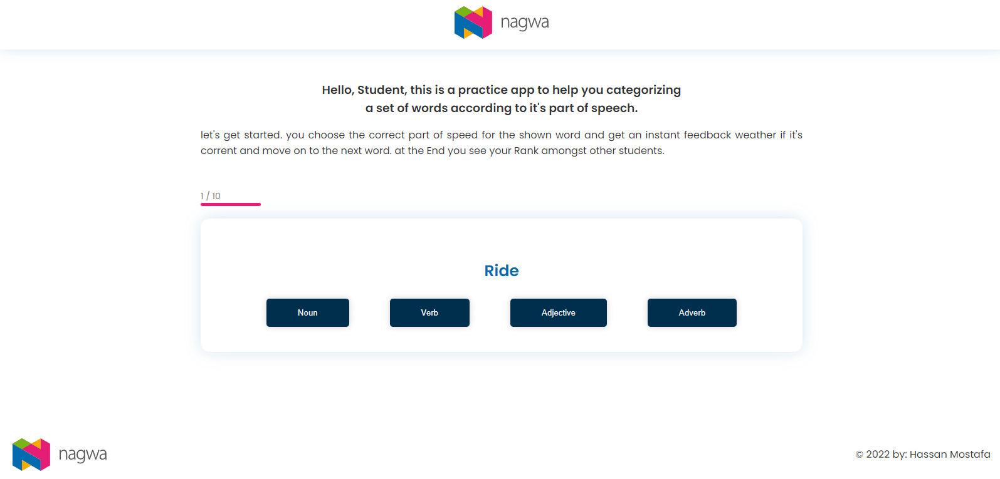
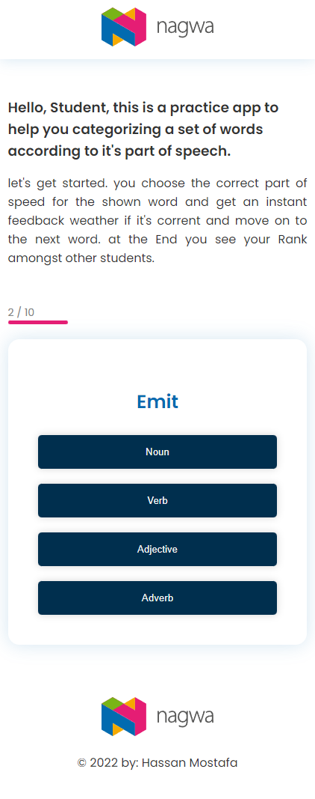
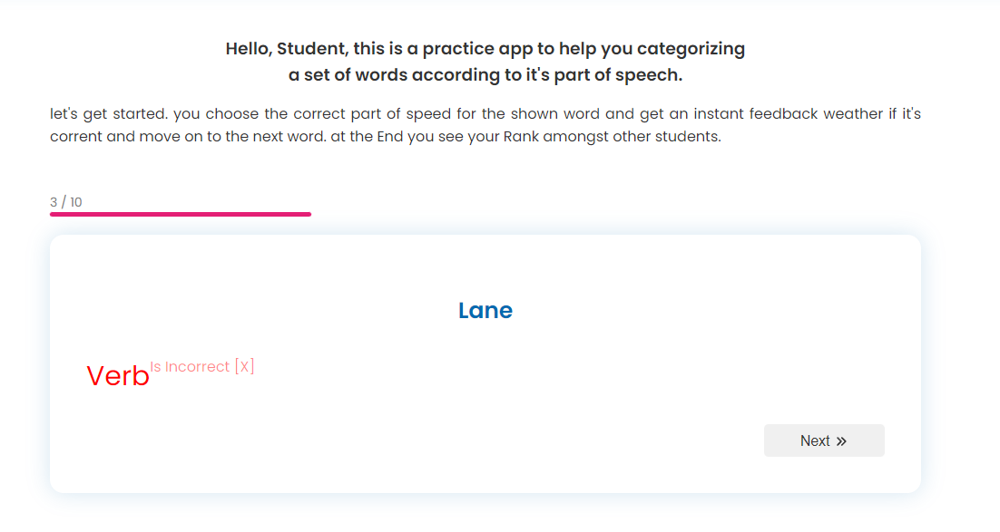
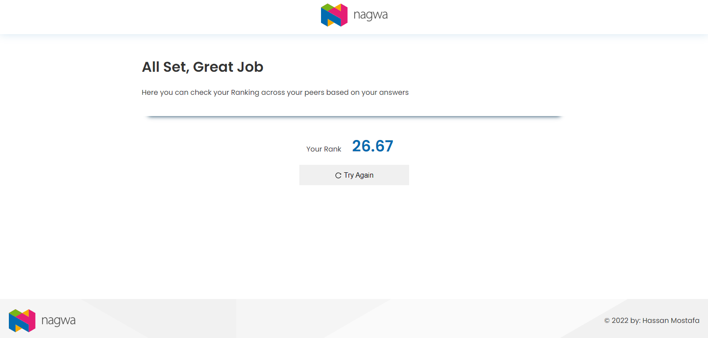

# Getting Started

# Installation

#### this will install all the depencies needed to run the app localy on your machine which you can check in the `package.json` file inside both the server and client directories

1 - BackEnd: inside the `server` directory open any terminal and enter `npm install` command.

2 - FrontEnd: inside the `client` directory open any terminal and enter the `npm intall` command

## Description & Usage

#

> - DATABASE

So I decided to break the back-end of this project to the actual server and a -fake- db using the proided TestData.json
using a third party library called `json-server`

it converts any json format into a functioning -fake- api.
already saved as a dependancy in the server direcotry. so to run the DB make sure you are inside the server folder and

run:
`json-server -w api/TestData.json -p 3001`

it will create the TestData.json file inside the api directory into an api running on port 3001

> - Back-End

using nodejs and express on port 3000. also make sure you are inside the `server` direcotry then

run: `npm run server`

It will start nodemon library which keeps the server running through any changes

> - Front-End

Using Reactjs, make sure you are inside the `client` directory with the database running on port 3001, and the backend server running on port 3000 then run `npm start`. to start the app. automatically react will try to run on port 3000 but because it's used. will ask you to run on different port? choose `yes` and it should start running on port 3002. or you can create .env file with PORT=3002 inside the `client` directory which react.js will use to run the app automatically

# User Prespective

> App Condition

- Database running with json-server on port 3001
- Server Running with Node.js and Express on port 3000
- Client running with React.js on port 3002

You should be seeing

1- Practice Page

or on small screens

which you will see a breif describtion and a card with a specific word and options to choose the part of speech for this word. after choosing you will get a feedback with your answer and a Next button to go to the next word

and you complete the 10 words given you will see a `see your rank` button instead of Next.
which will take you to

2- Rank Page

where you will find you ranking based on your score from your answers and a button to try again with another random 10 words

# Testing

For testing I would recommend an API platform like postman or Thunder Client VS Code extension to test the endpoint for the database and server.

**_please note that testing POST, PUT, or UPDATE on json-server's database api will actually change the data in the file server/api/TestData.json. which may cause issues._**

> ## Database Routes

The database api should be running on port 3001 with a certain directories

1 - `http://localhost:3001/wordList`

- this directory gets you all the words objects stored in the TestData.json file. although json-server allows all kinds of requests like POST and Delete but the main use of the app regarding this direcotry is to GET all the words

2 - `http://localhost:3001/scoresList`

- this directory responds with the scores array stored in the TestData.json file.

**_please note that testing POST, PUT, or UPDATE on json-server's database api will actually change the data in the file server/api/TestData.json. which may cause issues._**

> ## Backend Server Routes

The backend server should be running on port 3000

1 - `http://localhost:3000/api/words`

- a simple GET directory returns 10 random words objects containing at least one adjective, one adverb, one noun, and one verb from the words passed from the database.

2 - `http://localhost:3000/api/words`

- this directory takes {score:Number} object in the request body `checks that is exists` then checks that ` it's a number` then save databases's scores array length to calculate num of scores in database's scoresList which are below the given {score}, calculates the rank to the nearsest hundredth 00,0 , and then returns the rank

> ## Frontend

for the frontend you will just need to run `npm start` inside the client dirctory to start the react app and check design, performance, readability, and responsiveness with multiple screen sizes

# Quick Start

> you will need 3 terminals to run this app

their directories are.

1- /client "to run the front end"

2- /server "to run the database api"

3- /server "to run the backend server"

- in one of `/server` terminals run `npm install` to install the backend dependencies

- in the `/client` terminal run `npm install` to install the frontend dependencies

- in one of `/server` terminals run `json-server -w api/TestData.json -p 3001` to run the database api. make sure its running on port 3001

- in the other `/server` terminal run `npm run server` to run the backend server. make sure its running on port 3000

- in the `/client` terminal run `npm start` to start the react app and launch the frontend (the client side). make sure it's running on port 3002
